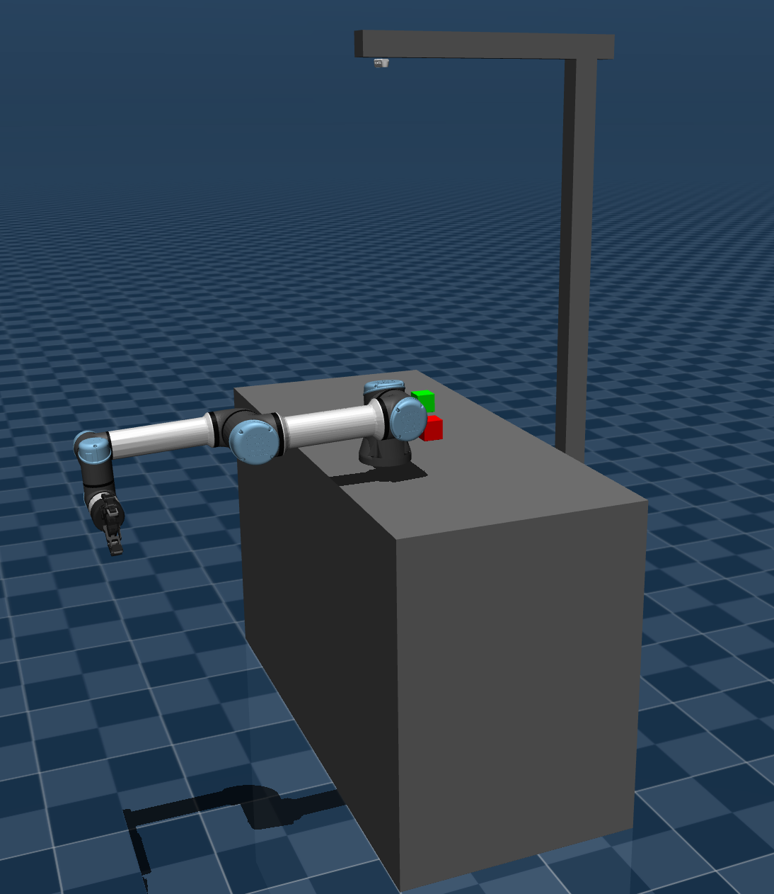

# mujoco_ros2_control with universal robot "ur5e and robotiq gripper

This repository provides a working simulation setup for a UR5e robot with a Robotiq 2F-85 gripper and an Intel RealSense D435i camera using `ros2_control` and MuJoCo. It is based on the [ros-controls/mujoco_ros2_control](https://github.com/ros-controls/mujoco_ros2_control) framework.

## Features

- UR5e + Robotiq 2F-85 gripper model using XML and URDF/XACRO
- Intel RealSense D435i camera on a pan joint, mounted on a static cantilever stand
- Two free-floating cubes (red/green) for manipulation
- `mujoco_ros2_control` integration for controlling joints
- MuJoCo as the physics engine
- Launch file to run the full simulation and controllers

## Requirements

- [ROS2](https://docs.ros.org/) (tested with Humble)
- [MuJoCo 3.x](https://github.com/google-deepmind/mujoco) 
- [mujoco_ros2_control](https://github.com/ros-controls/mujoco_ros2_control) — follow its installation steps to install `mujoco_ros2_control` itself before building this package


## Installation
### Clone the repository
```bash
mkdir -p ~/mujoco_ros2_ws/src
cd src
git clone https://github.com/abuibaid/mujoco_ros2_ur.git
```
### Install dependencies, build the workspace and source it
```bash
cd ~/mujoco_ros2_ws
rosdep install --from-paths src --ignore-src -r -y
colcon build 
source install/setup.bash
```
## Launch Simulation
```bash
ros2 launch mujoco_ros2_ur ur5e.launch.py
```

## ROS2 Topics

```
/camera/camera_info
/camera/color
/camera/depth
/camera_position_controller/commands
/camera_position_controller/transition_event
/client_count
/clock
/connected_clients
/dynamic_joint_states
/force_torque_sensor_broadcaster/transition_event
/force_torque_sensor_broadcaster/wrench
/gripper_controller/transition_event
/joint_state_broadcaster/transition_event
/joint_states
/joint_trajectory_controller/controller_state
/joint_trajectory_controller/joint_trajectory
/joint_trajectory_controller/state
/joint_trajectory_controller/transition_event
/mujoco_actuators_states
/parameter_events
/robot_description
/rosout
/tf
/tf_static
```

## Image

